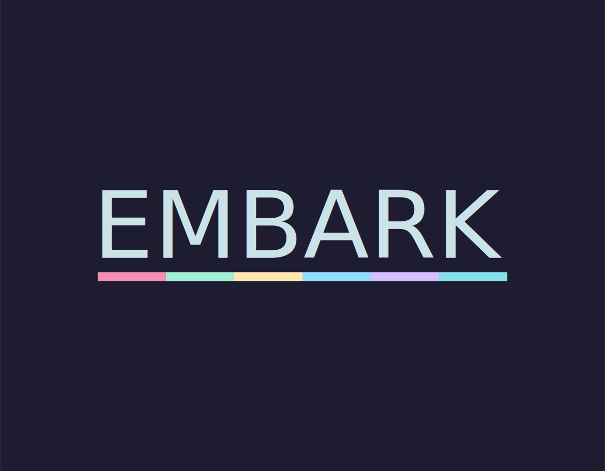
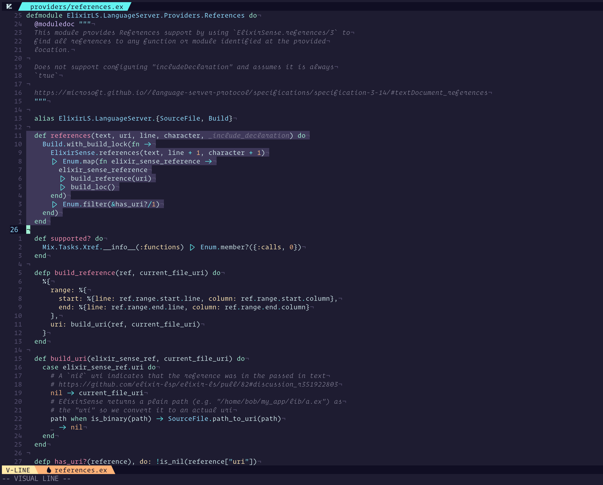

<p align="center"></p>

<p align="center"><strong>An ambitious Vim theme.</strong></p>

<p align="center"><em>"Man cannot discover new oceans unless he has the courage to lose sight of the shore. - Andre Gide"</em></p>



More screenshots [here](https://github.com/embark-theme/vim/wiki/Screenshots).

## Getting Started

> At this time only terminals supporting truecolors will work. Make sure you have `set termguicolors` in your vimrc

First install plugin with your favorite plugin manager. Note you should rename the plugin using your plugin manager's built in facilities to do so.

### vim-plug
```
Plug 'embark-theme/vim', { 'as': 'embark' }
```

### vim-packager
```
...
call packager#add('embark-theme/vim', { 'name': 'embark' })
...
```

Then set your colorsheme in vim.
```
colorscheme embark
```

### Lightline support

A lightline theme is also available. Just set your colorscheme to embark.

```
let g:lightline = {
      \ 'colorscheme': 'embark',
      \ }
```

### Airline support

Airline should just pick up on theme automatically, but if there is an issue with this it can be set manually.
`let g:airline_theme = 'embark'`

## Configuration

Embark offers a few configuration values to control features. Setting values to `1` will turn the feature on.

Italics - Make sure your terminal is set up to handle them. See [this](https://medium.com/@dubistkomisch/how-to-actually-get-italics-and-true-colour-to-work-in-iterm-tmux-vim-9ebe55ebc2be) for help getting italics and true color working in your terminal.

`let g:embark_terminal_italics = 1`

