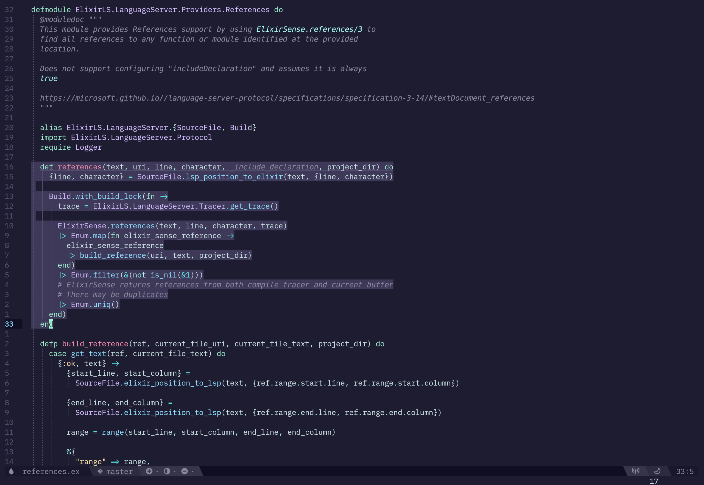

<div align="center">

[](#embark-vim)

**An ambitious Vim theme.**

<p><em>Man cannot discover new oceans unless he has the courage to lose sight of the shore.<br />- Andre Gide</em></p>



</div>

---

## Getting Started

> [!IMPORTANT]
> At this time only terminals supporting truecolors will work.
> Make sure you have `termguicolors` enabled.
>
> For Vimscript: `set termguicolors`
>
> For Lua (Neovim): `vim.o.termguicolors = true`

First install using your plugin manager.
Don't forget to change the plugin name to `embark` using your plugin manager's capabilities.

### lazy.nvim

```lua
{
  'embark-theme/vim',
  lazy = false,
  priority = 1000,
  name = 'embark'
}
```

### paq-nvim

```lua
require('paq') {
  { 'embark-theme/vim', as = 'embark' }
}
```

### vim-plug

```vim
Plug 'embark-theme/vim', { 'as': 'embark', 'branch': 'main' }
```

Then set embark as your colorscheme.

Vimscript:

```vim
colorscheme embark
```

Lua (Neovim):

```lua
vim.cmd.colorscheme('embark')
```

> [!TIP]
> For `lazy.nvim` users the colorscheme can be set up in the `config` callback:
>
> ```lua
> {
>   'embark-theme/vim',
>   lazy = false,
>   priority = 1000,
>   name = 'embark',
>   config = function()
>     vim.cmd.colorscheme('embark')
>   end
> }
> ```

### Lightline support

A lightline theme is also available. Just set your colorscheme to `'embark'`.

Vimscript:

```vim
let g:lightline = {
      \ 'colorscheme': 'embark',
      \ }
```

Lua (for Neovim):

```lua
vim.g.lightline = {
  colorscheme = 'embark'
}
```

### Airline support

Airline should just pick up on the theme automatically. If not you can set manually:

Vimscript:

```vim
let g:airline_theme = 'embark'
```

Lua (for Neovim):

```lua
vim.g.airline_theme = 'embark'
```

### Lualine support

For Neovim users, Lualine should pick up the theme with the `auto` setting. If not you can set it manually:

```lua
require('lualine').setup {
  options = {
    theme = 'embark'
  }
}
```

## Configuration

Embark offers a few configuration values to control features. Setting values to `1` will turn the feature on.

Italics - Make sure your terminal is set up to handle them. See [this](https://medium.com/@dubistkomisch/how-to-actually-get-italics-and-true-colour-to-work-in-iterm-tmux-vim-9ebe55ebc2be) for help getting italics and true color working in your terminal.

Vimscript:

```vim
let g:embark_terminal_italics = 1
```

Lua (for Neovim):

```lua
vim.g.embark_terminal_italics = 1
```

---

See other available ports at https://embark-theme.github.io/
